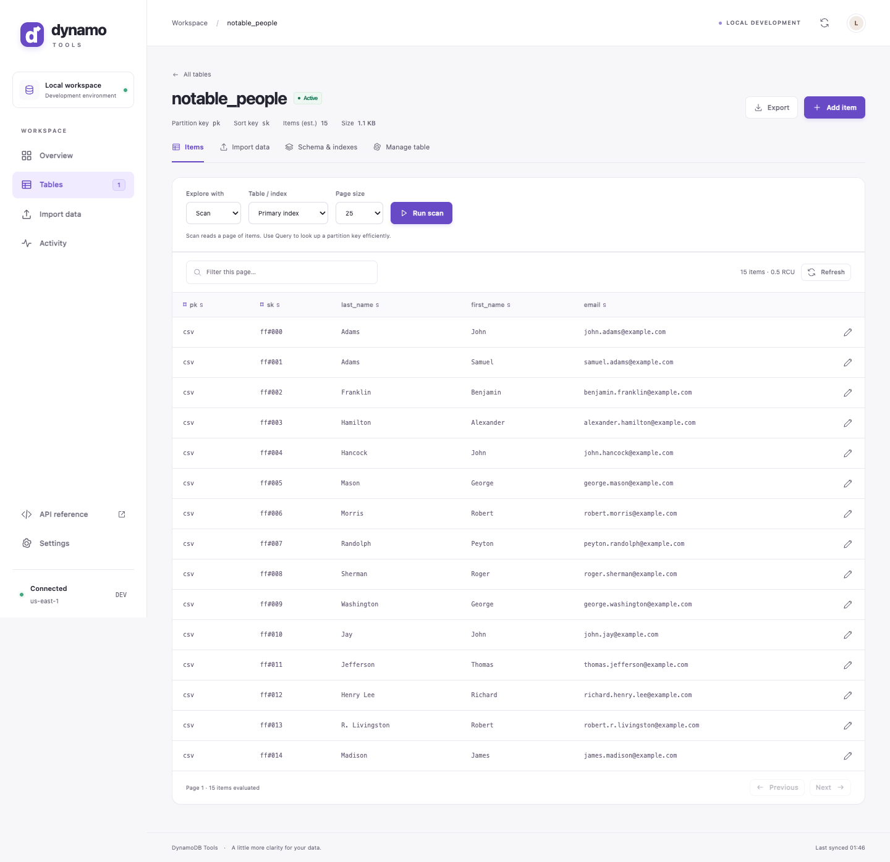

# DynamoDB Tools

A small, considered workspace for DynamoDB Local. Browse and query tables, edit
items, preview imports, export data, and keep track of your changes—all from the
same container that creates and seeds your development tables.

The interface is served at **`/`**, interactive API documentation at **`/docs`**,
and the original automation endpoints remain available.



## Try it

```bash
git clone https://github.com/barringtonhaynes/dynamodb-tools.git
cd dynamodb-tools
docker compose up --build
```

Open **[localhost:8002](http://localhost:8002)**. The included `compose.yaml` starts
an isolated, in-memory DynamoDB Local instance and seeds the `notable_people`
example. **This demo's data is disposable and resets when DynamoDB stops.**

No AWS account or browser build step is needed. The runtime serves its own HTML,
CSS, JavaScript, and icons without external fonts, CDNs, or analytics.

## In the workspace

| Area | What you can do |
| --- | --- |
| Overview | Check connectivity, table counts, estimated item counts and storage, recent activity, and quick actions. |
| Tables | Find tables by name. Create one with a guided key form or a full DynamoDB schema. |
| Item explorer | Scan/query tables and indexes; combine server-side filters with AND/OR or write expressions; select returned attributes, request consistent reads, and navigate pages. Page filtering remains available for quick local searches. |
| Bulk actions | Select visible items and delete them atomically with confirmation. Export the visible page, including its chosen attributes. |
| Streams | Enable/disable change capture, choose image contents, discover streams and shards, read from the oldest record, from now, or a sequence number; inspect before/after images and export a read. |
| PartiQL | Run parameterized SELECT, INSERT, UPDATE, or DELETE statements. Writes require confirmation; reads support continuation and result export. |
| Saved queries | Save named scans and queries, reload them from the first page, rename or update them, and delete saved definitions. |
| Data model | Inspect bounded samples for entity types, key prefixes, attribute presence, partition collections, and sparse-index eligibility. Open partition, prefix, and index queries directly. |
| Item editor | Switch between DynamoDB JSON, standard JSON, and an editable attribute table. Syntax-highlight and validate JSON, check table/index keys and an optional entity schema, inspect estimated sizes and type help, and create, edit, duplicate, or delete items. Creating an item refuses to overwrite an existing key. |
| Imports | Drag in CSV, plain JSON, or DynamoDB JSON; validate the entire file and preview records before importing. Load files from mounted folders too. |
| Exports | Download a complete paginated table scan as DynamoDB JSON, preserving numbers, sets, nested values, and base64 binary data. |
| Schema | Inspect keys, indexes, capacity, and the complete table definition. Apply `UpdateTable` JSON to change capacity or manage global indexes. |
| Manage | Configure TTL expiration attributes. Purge a table's items or delete the whole table, with exact-name confirmation. |
| Activity | Follow queued, running, completed, and failed operations. Shows up to 100 recent entries in the current server session. |
| Settings | Inspect endpoint, region, mounted path, and startup-task configuration. Change these through the container environment. |

The layout adapts to small screens. Forms have accessible labels, dialogs support
Escape, tabs support arrow keys, and `/` focuses the current table or page filter.
Saved queries persist in browser storage, scoped to the console origin, DynamoDB
endpoint, region, and table. They retain the index, exact key values, sort order,
page size, server filters, returned attributes, consistency, and page filter. They are not shared between browsers; clearing site
data removes them. Loading checks that the saved index and key schema still exist.

Item editor views share one draft. Switching or formatting validates the current
view first; invalid input remains available to fix. Standard JSON numbers are
converted on the server as exact decimals, avoiding browser rounding. Existing
binary values and sets retain their types at the same attribute paths (including
list positions); new strings and arrays become strings and lists. To change a
binary/set type or move one to a new path, use DynamoDB JSON or Attributes.
Primary keys are fixed during editing; use Duplicate to create new keys. Changes
are written only when you choose Create item or Save changes.

Long-running table changes and imports use a bounded, sequential background queue.

### Filters and read behavior

The filter builder supports comparisons, ranges, contains, begins-with, existence,
and type checks. Attribute names in the builder and returned-attribute list are
literal, including dots and reserved words. For nested document paths, IN, NOT,
or grouped expressions, use Expression mode with name aliases and typed values.

Filters run **after** DynamoDB evaluates a read page; they do not lower consumed
read capacity. An empty filtered page can still have a Next button. Returned
attributes always include the table's primary keys so item editing can fetch the
complete record. Global secondary indexes reject strongly consistent reads.
Saved queries include these options. Export page exports only the visible records
and returned attributes; Export in the table header still exports the whole table.

### Single-table models, sparse indexes, and item sizes

**Data model** reads a sample only when requested: at most 100 items or 1 MiB per
read. Next sample replaces the displayed page. Entity groups use your chosen
string attribute (default `entityType`), falling back to the first sort-key prefix;
these are observations, not a declared schema. Presence counts and mixed types
help spot inconsistent entities. Partition collections and index examples open
queries in Items, where you can refine and save them. The key workbench supports
full partition values and string sort-key prefixes such as `CUSTOMER#123` and
`ORDER#2026-09`.

Sparse-index coverage checks whether each sampled item supplies every index key
with the correct type and permitted length. Missing keys exclude an item;
malformed keys are reported separately. Eligibility does not prove that an index
has finished backfilling or propagating. Samples cannot establish whole-table
coverage or identify hot partitions. See AWS's
[sparse-index guidance](https://docs.aws.amazon.com/amazondynamodb/latest/developerguide/bp-indexes-general-sparse-indexes.html)
and [sort-key patterns](https://docs.aws.amazon.com/amazondynamodb/latest/developerguide/bp-sort-keys.html).

Read pages display estimated returned bytes and per-item sizes; projections measure
only returned attributes. Opening an item fetches the full record and reports read
capacity. Editor validation shows item bytes, compact DynamoDB JSON bytes, size by
attribute, index membership, and a warning above the 400 KiB base-item limit. Saves
report the estimated item size and actual capacity returned by DynamoDB; the write
receipt is also kept in Activity. PartiQL reads include returned-byte estimates.

Size estimates follow [AWS's item-size rules](https://docs.aws.amazon.com/amazondynamodb/latest/developerguide/CapacityUnitCalculations.html):
UTF-8 names/text, decoded binary, and collection overhead. Number sizes are
approximate. Estimates exclude storage billing overhead and index storage, and do
not represent billable read/write size. DynamoDB performs final size checks,
including the extra constraints for local secondary indexes. Capacity is reported
by the connected service; DynamoDB Local does not model production billing.

### Optional item schema

Both JSON editors highlight tokens without parsing numbers in the browser.
Validation checks typed DynamoDB values, nesting depth, primary keys, and present
index keys. The optional **Item schema** field accepts inline JSON Schema Draft
2020-12 rules for the standard JSON representation, regardless of the active view.
For example:

```json
{
  "type": "object",
  "required": ["entityType"],
  "properties": {"entityType": {"enum": ["Customer", "Order"]}},
  "if": {"properties": {"entityType": {"const": "Order"}}},
  "then": {
    "required": ["total"],
    "properties": {"total": {"type": "number", "minimum": 0}}
  }
}
```

Use Remember schema to persist rules in this browser, scoped like saved queries.
Clear and remember the field to remove them. Schema violations block console item
saves and identify the offending path. Rules are not enforced by DynamoDB, imports,
PartiQL, or other clients. References (`$ref` / `$dynamicRef`) are unsupported and
never fetched; format annotations are not assertions. Standard JSON represents
sets as arrays and binary values as base64 strings. Decimal parsing preserves
numeric precision in both the document and schema bounds.

### Streams, TTL, and PartiQL

The Streams tab reads the same endpoint as the database. Configure capture, then
refresh streams after the operation completes. Select a shard and starting point.
Read next continues the last read; empty reads can have a continuation. The viewer
reads up to 50 records at a time, without consuming/deleting them. Expired iterators
require a fresh read. Changing the view type requires disabling and re-enabling the
stream. Stream data is temporary; it is not a backup or a durable event archive.

TTL uses a numeric attribute containing Unix epoch seconds. Disabling the existing
attribute is required before switching to another. DynamoDB Local can accept TTL
configuration without automatically removing expired items; this console does not
schedule its own expiry worker.

The PartiQL tab starts with the current table but may target any table in this
connection. Use `?` placeholders and an array of DynamoDB JSON parameter values.
Writes are singleton statements and require a review dialog. SELECT results follow
DynamoDB's continuation token. When the service returns a last evaluated key with
no token, the UI explicitly reports an incomplete result and asks for a narrower
query. No writes are run by opening a tab or browsing results.

DynamoDB Local differs from AWS: it does not implement production throughput
behavior, tags, point-in-time recovery, or vector indexes. The console focuses on
local data development and does not expose simulated controls for those services.
See [AWS's local usage notes](https://docs.aws.amazon.com/amazondynamodb/latest/developerguide/DynamoDBLocal.UsageNotes.html),
[filter behavior](https://docs.aws.amazon.com/amazondynamodb/latest/developerguide/Query.FilterExpression.html),
and [stream iterator behavior](https://docs.aws.amazon.com/amazondynamodb/latest/APIReference/API_streams_GetShardIterator.html).

## Use with your existing DynamoDB container

Build a local image from this checkout:

```bash
docker build -t dynamodb-tools:local .
```

Add this service to the same Compose network as your DynamoDB Local service:

```yaml
services:
  dynamodb-tools:
    image: dynamodb-tools:local
    ports:
      - "127.0.0.1:8002:80"
    environment:
      DYNAMODB_ENDPOINT_URL: http://dynamodb:8000
      DATA_PATH: /data
    volumes:
      - ./dynamodb-data/create:/data/create:ro
      - ./dynamodb-data/update:/data/update:ro
      - ./dynamodb-data/seed:/data/seed:ro
      - ./dynamodb-data/load:/data/load:ro
    depends_on:
      - dynamodb
```

The console is intended for **trusted local development**. It has no login system;
keep its published port bound to localhost. Database credentials stay on the
server. Browser writes from a different origin are rejected.

### Connect to an AWS account

The console can run locally against real AWS DynamoDB. Set `DYNAMODB_MODE=aws`;
DynamoDB, Streams, and STS then use their own regional AWS endpoints. This mode
ignores the local endpoint override, disables **all startup mutations** regardless
of startup flags, and defaults to read-only. One server process connects to one
profile/account and region at a time. Use Settings to switch connections.

In **Settings → Choose a connection**, select AWS account and leave profile and
region blank to use the standard AWS SDK defaults, including `~/.aws/credentials`,
`~/.aws/config`, environment credentials, SSO, credential processes, and workload
roles. OS keychains work through a configured credential provider such as
`credential_process`; the app does not independently read arbitrary OS keychains.
Named profiles discovered in your AWS configuration appear as suggestions.

Choose Test connection to verify the account and region, then Save & connect.
Saving also verifies the connection, persists preferences atomically, and reloads
the interface. Failed checks preserve the previous connection. Switching is blocked
while requests, exports, or background operations are active. Other open tabs must
reload before operating on the new connection. Activity and startup counters clear
when you switch; changing a connection does not run startup tasks.

Preferences use a small JSON file containing mode, profile, region, endpoint, and
read-only choice—never access keys, tokens, or copied credentials. The path is shown
in Settings: `~/Library/Application Support/dynamodb-tools/connection.json` on
macOS, `$XDG_CONFIG_HOME/dynamodb-tools/connection.json` (default `~/.config`) on
Linux, and `%LOCALAPPDATA%/dynamodb-tools/connection.json` on Windows. Set
`CONNECTION_SETTINGS_PATH` to choose another path or isolate multiple console
instances. Saved connection fields override environment settings on subsequent
starts. Remove the saved file to return to environment/default configuration.
Startup mutations stay disabled for saved connections, including local endpoints.

Use an existing AWS CLI profile, including an IAM Identity Center / SSO profile.
For SSO, sign in on the host first:

```sh
aws sso login --profile your-profile
```

Run from this repository using its Python environment:

```sh
DYNAMODB_MODE=aws AWS_PROFILE=your-profile AWS_DEFAULT_REGION=eu-west-2 READ_ONLY=true \
  .venv/bin/uvicorn app.main:app --host 127.0.0.1 --port 18210
```

Then open **http://127.0.0.1:18210**. The workspace displays the account ID, region,
read-only status, and signed-in principal. No credentials are sent to the browser.
The existing local console can stay open on its own port. For a non-SSO profile,
skip the login command. Without `AWS_PROFILE`, the SDK uses its normal credential
chain (environment credentials, workload roles, and other configured providers).
Explicit profiles take precedence over stray environment credentials. Clear local
dummy credential environment variables before using the default AWS chain; the
Docker image supplies no dummy credentials or region in AWS mode.

Alternatively, run the separate AWS Compose configuration:

```sh
AWS_PROFILE=your-profile AWS_DEFAULT_REGION=eu-west-2 \
  docker compose -f compose.aws.yaml up --build
```

Open **http://127.0.0.1:8003**. This configuration mounts `~/.aws` read-only, persists connection preferences in
a named volume, and starts no emulator. `AWS_PROFILE` and `AWS_DEFAULT_REGION` are
optional; when omitted, the SDK uses your configured defaults. Refresh SSO sessions on the host when they expire; profiles
that depend on an external `credential_process` need that program available inside
the container, so native Python is simpler for those profiles.

`READ_ONLY=true` permits browsing, scans, queries, exports, stream reads, and
PartiQL SELECT. Both the HTTP layer and shared SDK boundary reject writes,
including legacy imports, batches, transactions, and PartiQL changes. To enable
manual writes, select Allow writes in Settings and Save & connect (or configure
`READ_ONLY=false` before a connection has been saved); startup mutations remain disabled
in AWS mode. IAM is the authorization boundary: a read-only IAM role provides
additional protection, and enabling writes in this app never grants AWS permissions.

AWS writes stay guarded even after choosing **Allow writes**. Purge and table deletion
are tucked inside a collapsed **Danger zone**. Every database-changing request—including
item edits/deletes, imports, schema updates, TTL, Streams, and PartiQL writes—requires a
separate confirmation showing the verified account, region, action, and target. Type
the displayed phrase and wait five seconds before applying it. PartiQL shows the full
statement because it can target a different table from the current workspace.

The server enforces the pause and a two-minute expiry. Each approval is single-use,
bound to the exact request body, method, path, query, connection, and AWS identity;
changing any of these requires another confirmation. Approvals live only in memory
and do not create a general write-unlock window. Read-only mode still blocks writes
entirely. Local development keeps its existing workflow. These are accident-prevention
controls, not authentication or a replacement for IAM. There is no automatic undo.

The connection verifies identity through STS and needs `dynamodb:ListTables` and
`dynamodb:DescribeTable` to show the workspace. Grant the data actions you need
(e.g. `GetItem`, `Scan`, `Query`, `PartiQLSelect`, `DescribeTimeToLive`) on the
relevant tables and indexes. Streams additionally need `ListStreams`,
`DescribeStream`, `GetShardIterator`, and `GetRecords` for the appropriate streams.
An account with restricted table permissions may reject the all-table overview.
Reads, sampling, and exports use real AWS capacity even in read-only mode. Bind
the app to localhost; it does not add a web login or multi-user access controls.

Saved queries and item schemas are separated by AWS account, region, and table.
Use [AWS's credential setup guide](https://docs.aws.amazon.com/boto3/latest/guide/credentials.html)
for profiles, SSO, environment credentials, and assumed roles.

### Mounted files

```text
data/
├── create/                       # CreateTable JSON schemas
│   └── notable_people.json
├── update/                       # UpdateTable JSON schemas
│   └── notable_people.json
├── seed/                         # Loaded during startup
│   └── notable_people/
│       └── people.csv
└── load/                         # Available for on-demand imports
    └── notable_people/
        └── scientists.dynamodb.json
```

Missing folders are treated as empty. Files are processed in filename order.
CSV and JSON data files are discovered; unrelated files and directories are
ignored. API file loads, including symlink targets, must stay within the selected
table's load folder. Uploaded files are processed in memory and are not saved to
the mounted folders.

### Supported formats

- **CSV:** the first row contains attribute names. Values are strings. Use JSON
  when a table has numeric or binary primary keys. UTF-8 files with a BOM work.
- **JSON:** an array of objects. Numbers are parsed as exact decimals on the server.
- **DynamoDB JSON:** an array of typed items in a `.dynamodb.json` file. Example:

```json
[
  {
    "pk": {"S": "person#ada"},
    "sk": {"S": "profile"},
    "name": {"S": "Ada Lovelace"},
    "score": {"N": "12.50"},
    "active": {"BOOL": true}
  }
]
```

The editor and export format use typed JSON so JavaScript never rounds DynamoDB's
high-precision numbers. For binary values, `B` and `BS` use base64 strings.
Every imported item must contain all table keys with matching types. Browser
imports are limited to **10 MB**; startup seeding can read larger local files.

### Operational behavior

- Startup tasks finish before the application accepts requests. Failures stop
  startup and are logged; importing the Python application does not touch tables.
- Creating an existing table is skipped during startup. An identical single-index
  creation update is skipped when the index is already active; other invalid
  updates fail visibly. Console table creation reports an existing table as a failure.
- Imports replace records with matching primary keys. They are **not transactions**:
  earlier batches may remain after a later failure. Correct the file before retrying.
- Item edits replace the displayed item. Primary keys cannot change during editing;
  duplicate the item with a new key instead. Concurrent edits use last-writer-wins.
- Item counts and sizes are DynamoDB estimates. Scans and exports are not snapshots
  of a table receiving concurrent writes. A failed streaming export may leave a
  partial file; Activity marks it as interrupted.
- Run **one application worker**. Queue state, activity history, and statistics are
  in memory and reset when the server restarts. Do not stop it during an active write.
- The `seeded` counter tracks successful files, not individual records.

## Configuration

| Environment variable | Default | Purpose |
| --- | --- | --- |
| `LOG_LEVEL` | `INFO` | Logging verbosity |
| `DATA_PATH` | `/data` | Root of the mounted file folders |
| `DELETE_TABLES_ON_STARTUP` | `False` | Delete all tables before other tasks |
| `PURGE_TABLES_ON_STARTUP` | `False` | Empty all tables before other tasks |
| `CREATE_TABLES_ON_STARTUP` | `True` | Apply schemas from `create/` |
| `UPDATE_TABLES_ON_STARTUP` | `True` | Apply schemas from `update/` |
| `SEED_TABLES_ON_STARTUP` | `True` | Load files from `seed/` |
| `DYNAMODB_MODE` | `local` | `local` endpoint or `aws` regional services |
| `READ_ONLY` | `false` locally; `true` in AWS mode | Block database mutations and startup tasks |
| `AWS_PROFILE` | Unset | Named AWS CLI/SSO profile for AWS mode |
| `DYNAMODB_ENDPOINT_URL` | `http://dynamodb:8000` | Local endpoint; ignored in AWS mode |
| `AWS_REGION` | Unset | Explicit region preference; blank uses SDK defaults |
| `AWS_DEFAULT_REGION` | SDK profile default; `us-east-1` locally | Standard SDK region override |
| `CONNECTION_SETTINGS_PATH` | OS application configuration folder | Local connection preferences JSON path |
| `AWS_ACCESS_KEY_ID` | `localaccesskey` in local mode | Local dummy key; AWS mode uses the credential chain |
| `AWS_SECRET_ACCESS_KEY` | `localsecretkey` in local mode | Local dummy secret; AWS mode uses the credential chain |
| `AWS_SESSION_TOKEN` | Unset | Optional AWS session token |

Dummy credentials are supplied only for local mode; they are not baked into the
Docker image. AWS mode uses boto3's credential providers. Startup flags apply only
to local connections with writes enabled.

## API

See **`/docs`** for the full request schemas and try-it controls.

| Method and route | Purpose |
| --- | --- |
| `GET /health` | Startup status, file counters, and settings (legacy) |
| `GET /tables` | Table names (legacy) |
| `GET /tables/{name}/data` | Mounted file names (legacy) |
| `POST /tables/{name}/data/{file}` | Synchronous mounted-file import (legacy) |
| `GET /api/overview` | Connection, table metadata, counters, activity |
| `POST /api/tables` | Queue table creation using `definition` |
| `GET /api/tables/{name}` | Table description |
| `PATCH /api/tables/{name}` | Queue schema update using `definition` |
| `DELETE /api/tables/{name}` | Queue deletion; requires `confirmation` equal to the table name |
| `POST /api/tables/{name}/purge` | Queue purge; requires the same confirmation |
| `POST /api/tables/{name}/items/search` | Scan/query a page with an opaque continuation cursor |
| `POST /api/items/convert` | Validate/format editor JSON and convert views without writing data (`text`, `view`, optional typed `previous`) |
| `POST /api/tables/{name}/items/get` | Fetch an item by typed `key` |
| `PUT /api/tables/{name}/items` | Create/edit a typed `item`; optionally provide `originalKey` |
| `DELETE /api/tables/{name}/items` | Delete by typed `key` |
| `POST /api/tables/{name}/items/delete-selected` | Atomically delete up to 100 selected keys with table-name confirmation |
| `GET /api/tables/{name}/streams` | Discover stream configuration and available streams |
| `PUT /api/tables/{name}/streams` | Queue stream enable/disable and view configuration |
| `GET /api/tables/{name}/streams/shards?arn=…` | List all shards for a selected stream |
| `POST /api/tables/{name}/streams/records` | Read a shard using a starting position or continuation |
| `GET/PUT /api/tables/{name}/ttl` | Inspect or queue TTL configuration |
| `POST /api/partiql` | Execute one parameterized statement; writes require `allowWrite` |
| `GET /api/tables/{name}/files` | Mounted file metadata |
| `POST /api/tables/{name}/imports/preview` | Validate `filename` and `content`; preview five records |
| `POST /api/tables/{name}/imports` | Queue a validated file import |
| `POST /api/tables/{name}/imports/mounted` | Queue an import by mounted `filename` |
| `GET /api/tables/{name}/export` | Stream a DynamoDB JSON download |
| `GET /api/operations` | Current session's activity |
| `GET /api/operations/{id}` | Status of a queued operation |
| `GET /api/settings` | Read-only configuration |

In AWS write mode, mutation requests first return **428** with `awsConfirmation`.
After reviewing its account, target, and action, wait `waitSeconds`, then resubmit the
**identical** request with `X-AWS-Challenge` set to its `token` and
`X-AWS-Confirmation` set to its exact `phrase`. This handshake also applies to legacy
imports and API documentation requests. A missing approval cannot dispatch a write;
early, mismatched, expired, or reused approvals return 409. If a submitted write's
outcome is uncertain, inspect the item or operation before starting another approval.

Queued requests return **202** with an operation ID. Poll that operation to learn
whether it completed or failed; acceptance is not success. Invalid input returns
400/422, missing resources 404, item conflicts 409, and upstream failures 502/503.

## Development and tests

Python 3.11+ runs the application. Node.js is only needed for formatting and browser
tests, not for serving the interface.

```bash
python -m venv .venv
source .venv/bin/activate
pip install -r requirements-dev.txt
python -m pytest -q
pre-commit run --all-files
```

Tests use Moto and dummy credentials, covering data formats, decimal precision,
binary/set round trips, pagination, query conditions, CRUD, file containment,
background operation failures, and startup behavior.

To run Python directly, start a disposable DynamoDB Local instance and set its
endpoint and dummy credentials:

```bash
export AWS_ACCESS_KEY_ID=localaccesskey
export AWS_SECRET_ACCESS_KEY=localsecretkey
export AWS_DEFAULT_REGION=us-east-1
export DYNAMODB_ENDPOINT_URL=http://127.0.0.1:8000
export DATA_PATH=./examples/basic
uvicorn app.main:app --host 127.0.0.1 --port 18200 --reload
```

For the browser suite, point at a console using **disposable DynamoDB Local**.
It creates a uniquely named test table and removes it afterwards. Screenshots and
accessibility reports are written to the ignored `test-results/` folder.

```bash
npm ci
npx playwright install chromium
npm run check
CONSOLE_TEST_URL=http://127.0.0.1:18200 npm run test:browser
```

Set `PLAYWRIGHT_CHANNEL=chrome` to test with an installed Chrome instead.
The suite exercises desktop/mobile layouts, keyboard behavior, WCAG accessibility
checks, table/item creation and editing, imports, pagination, filtering, range
queries, downloads, purge confirmation, and deletion.

Pull requests run Python tests, formatting, browser checks against DynamoDB Local,
and a runtime container build. Publishing the Docker image happens only after
checks pass on a push to `main`.
